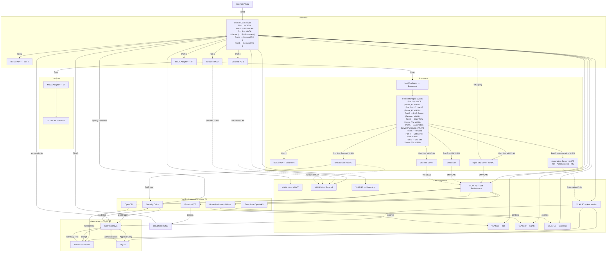

# Network Topology — Mermaid Diagram

GitHub renders Mermaid natively in Markdown files.

```mermaid
graph TD
    WAN[Internet / WAN]
    CF[Cloudflare DDNS]

    subgraph Floor2["2nd Floor"]
        UCG["UniFi UCG Firewall
        Port 1 — WAN
        Port 2 — U7 Lite AP
        Port 3 — MoCA Adapter (to 1F & Basement)
        Port 4 — Secured PC 1
        Port 5 — Secured PC 2"]
        AP2[U7 Lite AP — Floor 2]
        PC1[Secured PC 1]
        PC2[Secured PC 2]
        MOCA2[MoCA Adapter — 2F]
    end

    subgraph Floor1["1st Floor"]
        MOCA1[MoCA Adapter — 1F]
        AP1[U7 Lite AP — Floor 1]
    end

    subgraph Basement["Basement"]
        MOCAB[MoCA Adapter — Basement]
        SW["8-Port Managed Switch
        Port 1 — MoCA (Trunk, All VLANs)
        Port 2 — U7 Lite AP (Trunk, All VLANs)
        Port 3 — DNS Server (Secured VLAN)
        Port 4 — OpenTofu Server (VM VLAN)
        Port 5 — Automation Server (Automation VLAN)
        Port 6 — Unused
        Port 7 — VM Server (VM VLAN)
        Port 8 — 2nd VM Server (VM VLAN)"]
        APB[U7 Lite AP — Basement]
        DNS[DNS Server miniPC]
        TOFU[OpenTofu Server miniPC]
        AUTO[Automation Server miniPC
        n8n · Automation AI · ntfy]
        VM1[VM Server]
        VM2[2nd VM Server]
    end

    subgraph VLANs["VLAN Segments"]
        MGMT[VLAN 10 — MGMT]
        SEC[VLAN 20 — Secured]
        IOT[VLAN 30 — IoT]
        LIGHTS[VLAN 40 — Lights]
        CAMS[VLAN 50 — Cameras]
        STREAM[VLAN 60 — Streaming]
        VM[VLAN 70 — VM Environment]
        AUTOV[VLAN 80 — Automation]
    end

    subgraph VMEnv["VM Environment — VLAN 70"]
        HASS[Home Assistant + Ollama]
        FVTT[Foundry VTT]
        SECON[Security Onion]
        OCTI[OpenCTI]
        OV[Greenbone OpenVAS]
    end

    subgraph AutoEnv["Automation — VLAN 80"]
        N8N[N8n Workflows]
        OLLAMA[Ollama — Llama3]
        NTFY[ntfy.sh]
    end

    WAN -->|Port 1| UCG
    CF -->|DDNS| UCG

    UCG -->|Port 2| AP2
    UCG -->|Port 4| PC1
    UCG -->|Port 5| PC2
    UCG -->|Port 3| MOCA2

    MOCA2 -->|Coax| MOCA1
    MOCA2 -->|Coax| MOCAB

    MOCA1 --> AP1

    MOCAB --> SW
    SW -->|Port 2| APB
    SW -->|Port 3 — Secured VLAN| DNS
    SW -->|Port 4 — VM VLAN| TOFU
    SW -->|Port 5 — Automation VLAN| AUTO
    SW -->|Port 7 — VM VLAN| VM1
    SW -->|Port 8 — VM VLAN| VM2

    UCG --> MGMT & SEC & IOT & LIGHTS & CAMS & STREAM & VM & AUTOV

    PC1 & PC2 -.->|Secured VLAN| SEC
    DNS -.->|Secured VLAN| SEC
    TOFU -.->|VM VLAN| VM
    AUTO -.->|Automation VLAN| AUTOV
    VM1 & VM2 -.->|VM VLAN| VM

    VM --> HASS & FVTT & SECON & OCTI & OV

    HASS -->|controls| IOT & LIGHTS & CAMS
    FVTT -->|domain| CF

    UCG -->|Syslog + Netflow| SECON
    DNS -->|DNS logs| SECON

    AUTOV --> N8N & OLLAMA & NTFY

    SECON -->|alert trigger| N8N
    OCTI -->|CTI context| OLLAMA
    N8N -->|prompt| OLLAMA
    OLLAMA -->|summary + fix| N8N
    N8N -->|Approve/Deny| NTFY
    NTFY -->|admin decision| N8N
    N8N -->|approved rule| UCG
    N8N -->|audit log| SECON

    TOFU -->|tofu apply| UCG
```
